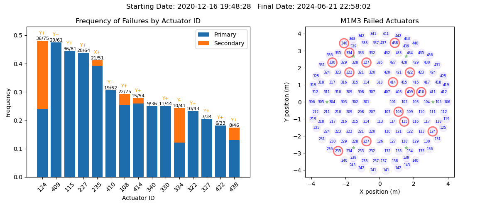

#############################
M1M3 mirror cell bump testing
#############################

.. abstract::

   To test the functionality of the pneumatic actuators on the M1M3 mirror cell, small perturbations are applied to each of the actuators in turn.
   This technote describes those tests and how to access the test results from the EFD.
   It also gives a short summary on the actuators with the highest rate of failures.

.. Metadata such as the title, authors, and description are set in metadata.yaml

.. TODO: Delete the note below before merging new content to the main branch.

Introduction
================
The M1M3 mirror cell supports the weight of the M1M3 primary mirror for the Simonyi telescope.  The 17 tons of mirror are supported by 156 pneumatic actuators where 44 are single-axis and provide support only in the axial direction (parallel to the telescope optical axis), 100 are dual-axis providing support in the axial and lateral direction, and 12 are dual-axis providing support in the axial and cross lateral directions.  Figures 1 and 2 show the locations of the actuators.  Figure 2 shows the actuator types.  Note that most of the dual-axis actuators apply force in the +Y direction.  This is because this is the force needed to support the weight of the mirror as the telescope tilts to lower elevations.

   A screenshot of the MTM1M3 GUI, showing the actuator locations and IDs.

.. figure:: ./_static/Actuator_Types.png
   :alt: Actuator types

   This figure shows the actuator types.

Positioning is provided by 6 hard points in a hexapod configuration which moves the mirror to a fixed operational position that shall be maintained during telescope operations. The remaining optical elements will be moved relative to this position in order to align the telescope optics. Support and optical figure correction is provided by the pneumatic actuators.
Each actuator consists of a piston and valves to apply compressed air on either side of the piston, so that each actuator has the capability to push and pull.

To test the functionality of the actuators, there is a test applied to each actuator which is referred to as a "bump test". This is usually performed with the mirror lowered (on static support), so the force actuators can be tested before the mirror is raised. The test is performed by applying an additional force of about 200 Newtons in both the positive and negative directions. For actuators that are dual-axis, the primary actuator (in the axial direction) is bumped first, followed by the secondary actuator. The bump test can be performed on either a single cylinder, or a single actuator, or it can be cycled through all of the actuators in succession.

Bump Test Overview
======================

During the bump test, perturbations of about 200 N are applied to the actuators for a few seconds.  Figure 3 shows the target forces to be applied, and Figure 4 shows the actual measured forces.

.. figure:: ./_static/Bump_Test_Target.png
   :alt: Target forces

   This shows the target forces to be applied to the actuators during the bump test of a single actuator.

   This shows the actual measured forces applied by the actuators during the bump test of a single actuator

Bump Test Indexing
==================================

The actuators are numbered sequentially from 0-155.  The secondary cylinders and the X, Y, and Z forces are also numbered sequentially.  Since there are different numbers of each of these, a set of look-up tables are provided to go from the actuator ID to the sequential numbers of the actuators of different types.  Table 1 shows how to move between the actuator IDs, the actuator index, and the indices for the various types of actuators.

::
   
  from lsst.ts.xml.tables.m1m3 import actuator_id_to_index,FAIndex,FATable,force_actuator_from_id

  Actuator ID (as in Figure 1): 101
  actuator_id_to_index(101) : 0
  force_actuator_from_id(101).index : 0
  actuator_id_to_index(101, FAIndex.SECONDARY): None
  force_actuator_from_id(101).s_index : None

  actuator_id_to_index(102, FAIndex.SECONDARY): 0
  force_actuator_from_id(102).s_index : 0

  Actuator ID (as in Figure 1): 227
  actuator_id_to_index(227) : 61
  actuator_id_to_index(227, FAIndex.SECONDARY):46
  actuator_id_to_index(227, FAIndex.Y):42
  actuator_id_to_index(227, FAIndex.Z): 61

  Since all actuators provide force in the Z direction, the ZINDEX and the INDEX are equal.

  The following actuator is one of the 12 that provides force in the X direction.

  Actuator ID (as in Figure 1): 135
  actuator_id_to_index(135) : 34
  actuator_id_to_index(135, FAIndex.X): 2

Table 1: Navigating between actuator IDs and sequential indices.

Bump Test States
==================================

As the bump test cycles through the testing, the EFD location:

| lsst.sal.MTM1M3.logevent_forceActuatorBumpTestStatus
|

returns where in the bump test cycle the test is.  Figure 5 shows the progression of these states.  At the conclusion of the test for each actuator, the state will either be 6 (PASSED) or 7 (FAILED).  the pass-fail criteria are described later in the "Bump Test Following Errors" section.

.. figure:: ./_static/Bump_Test_States.png
   :alt: Bump test states

   This shows the bump test states as logged in `lsst.sal.MTM1M3.logevent_forceActuatorBumpTestStatus`.

Finding Individual Bump Tests
==============================

When a bump test is finished, it keeps publishing the status (either PASSED or FAILED) until the next bump test is started.
From the diagram above, a bump test is considered to be successful if it follows the sequence of states as shown in Figure 5: 

::

  "NOTTESTED" -> "TESTINGPOSITIVE" -> "TESTINGPOSITIVEWAIT" -> 
  -> "TESTINGNEGATIVE" -> "TESTINGNEGATIVEWAIT" -> "PASSED" 

If the sequence is broken at any point, the test is considered to have failed. 
We used that information to find the start and end of each bump test, and then obtain absolute statistics for the rate of failures (Sec. :ref:`Trouble-makers`).  

XYZ forces vs Cylinder forces
==============================

The force data in the EFD includes both the forces applied to the primary and secondary cylinders, as well as the forces in the X, Y, and Z directions.  The X, Y, and Z directions are in the mirror coordinate system, as described in this link (https://confluence.lsstcorp.org/pages/viewpage.action?pageId=47220348). The cylinder forces and the X, Y, Z forces are not the same, as will be explained in this section.  Referring to Figure 6, we see that the primary cylinder applies force in the axial direction, which is along the optical axis of the telescope, and is referred to as the Z direction.  So the force applied by the primary cylinder is equal to the Z-force.  The secondary cylinder however, is at a 45 degree angle to the Z-axis.  So if we want to apply a force in the lateral direction (X or Y), we need to apply a force with the secondary cylinder, and then a negative force with the primary cylinder so that the resultant is in the lateral direction.
As the angle of the secondary cylinder is 45 degrees, transforming mirror coordinate systems forces into secondary cylinder is (mirror_force) / sqrt(2). Assume Z and Y Dual Axis Actuator (DAA) should produce Z force +10 N, and Y +25 N. Then the primary cylinder force would be 10 - (25 * sqrt(2)) N, and secondary cylinder force would be 25 * sqrt(2) N.

.. figure:: ./_static/Force_Schematic.png
   :alt: Force schematic
   
   This schematic of the actuators shows the relation between the cylinder forces and the resulting axial and lateral forces.

The primary and secondary forces are what is actually measured, and the X, Y, and Z forces are calculated from these forces and the known geometry.  So Figures 3 and 4 show the Y and Z forces.  Figures 7 and 8 show the target and actual forces in the primary and secondary cylinders.  Note the negative primary force being applied during the secondary bump test.

.. figure:: ./_static/Bump_Test_Cylinder_Target.png
   :alt: Target forces
   
   This shows the target forces to be applied to the primary and secondary actuators during the bump test of a single actuator.

.. figure:: ./_static/Bump_Test_Cylinder_Results.png
   :alt: Actual measured forces

   This shows the actual measured forces applied by the primary and secondary actuators during the bump test of a single actuator

Bump Test Following Errors
==============================

We can also plot the bump test following errors, which are the difference between the target force and the actual measured force.  The actuator is not able to follow the step function in the applied force, so there is large spike in the following error after a change in the target force.  For this reason, the plot in Figure 9 uses the "symlog" scale, which is linear between -10 N and +10 N, and log above +/-10 N.  This allows one to see the errors in the relatively flat region of the test, which is most important.

   
   Bump test following errors. The dotted vertical line shows where the pass/fail decision is made (SettleTime below).  If this is within the red lines (Error below), then the bump test passes.

The levels and times for the absolute value of the following error are specified in M1M3 SS CSC configuration file (ts_config_mttcs/MTM1M3/v1/_init.yaml):

|
|  BumpTest:
|    TestedTolerances:
|      Warning: 2.5 (green lines in Figure 9)
|      Error: 5 (red lines in Figure 9)
|    NonTestedTolerances:
|      Warning: 20
|      Error: 100
|    SettleTime: 3.0
|    Measurements: 10
|

Where non-tested mean all other Force Actuators (FAs)s (the algorithm checks if all other except for tested cylinder doesn't show significant force), tested are error and warning levels for cylinder being tested. The algorithm waits up to SettleTime seconds to see "Measurements" number of measured absolute values dropping below errorr level for FA to pass the test. If measured values venture above "warning" level, but stay within "error" level, a warning is sent into the M1M3 log.

.. _Trouble-makers:

Trouble makers
==============

In order to determine which actuators causes more trouble, we calculated the rate of failures for all Bump Tests available in the efd to the date, before glass installation.
In Figure 10, we show the absolute frequency of failures over the total executed bump test for each actuator. 
Note that secondary actuators fail mostly in the Y direction, with only actuator 235 having a failure in the X direction (it has been replaced since then).

   Total frequency of failures with spatial distribution of the actuators. 
   The direction of the Secondary failures are shown in orange on top of the corresponding bar along with the total failures *versus* the total number of bump tests executed.
   As stated above, Primary actuators will always have failures in the Z direction.

Figure 11 shows the same result as the histogram from Figure 10, but now highlighting the spatial distribution of the actuators with the relative frequency of failures.
It shows that no quadrant has more failures than the others.

   Distribution of the relative frequency of failures.

Types of bump test failures
==============================

David Sanmartim has written code to find and characterize all of the bump test failures between 2023-11-01 and 2024-01-15.  The nights between 2023-11-09 and 2023-12-12 were omitted because there were some unexplained failures.  This represents 164 different bump test failures. Table 2 shows the type of information available from the EFD.  Figures 12, 13, 14, and 15 show different ways to look at the failures.

In the data directory of this technote is a set of plots of all of the bump test failures, labeled Bump_Test_Failures_01Apr24.pdf.
 
::
   
 Time: 2023-11-30 00:00:00
 ID: 235
 Orientation: Z
 Index: 69
 Error Message: measured force plus (204.525) is too far 222±5
 MeasuredForce: 204.525
 AppliedForceDirection: Positive
 Deviation: -17.475
 AbsMeasuredForce: 204.525
 DaysSinceFirst: 22

Table 2: Information on bump test failures in the EFD

   
   Absolute Measured Forces by FA ID.

   Average Deviation with Dispersion by Actuator ID and Error Type.

   Absolute Measured Force for Failed Actuators.

From Figs. 11, 12 and 13 we can summarize that: 

* The actuators are more likely to fail when they are pushing the mirror up, rather than down.
  The magnitudes of the deviations tend also to be larger for forces applied in the positive direction.

* The actuators that failed the bump test are not getting worse over time,
  as the measured forces don't follow any specific trend over time.

* Actuators that pass the bump test would also need to publish/report the measured forces in the EFD,
  so we can monitor them overtime and catch possible failures before they actually happen.

The figure below have a summary of the bump test failure types:

   
   Bump test failure types, 2023-11-01 to 2024-01-15.

High-level statistics of all of the bump test failures:

* actual force overshoot compared to the demanded force: about 23%.
* actual force undershoot compared to the demanded force: about 74%.
* excessive latency of the actual force compared to the demanded force: None seen.
* locked/constant force independent of demand: about 6%.

Summary
==============

This technote describes the M1M3 mirror cell bump tests and describes how they are done and shows some of the results.  Most of the plots shown here can be reproduced with the `SITCOM_818_SITCOMTN-083.ipynb`_ from the `lsst-sitcom/notebooks_vandv`_ github repository.

The notebook that made Figure 2 is in the notebooks directory of this technote, and is called MTM1M3_Movie_16Nov23.ipynb. It can also make movies of the actuator forces vs time.

The plots showing the rate of failures are part of the notebook `SITCOMTN-083_m1m3_bump_test_failure_analysis.ipynb`_ from `lsst-sitcom/notebooks_vandv`_ github repository.

The plots in the last section showing the fail statistics were generated with `SITCOM-1165_m1m3_bump_test_error_and_measured_forces.ipynb`_  from `lsst-sitcom/notebooks_vandv`_ github repository.

.. _lsst-sitcom/notebooks_vandv: https://github.com/lsst-sitcom/notebooks_vandv/

.. _SITCOM_818_SITCOMTN-083.ipynb: https://github.com/lsst-sitcom/notebooks_vandv/blob/develop/notebooks/tel_and_site/subsys_req_ver/m1m3/SITCOM-818_SITCOMTN-083.ipynb
.. _SITCOMTN-083_m1m3_bump_test_failure_analysis.ipynb: https://github.com/lsst-sitcom/notebooks_vandv/blob/develop/notebooks/tel_and_site/subsys_req_ver/m1m3/SITCOMTN-083_m1m3_bump_test_failure_analysis.ipynb
.. _SITCOM-1165_m1m3_bump_test_error_and_measured_forces.ipynb: https://github.com/lsst-sitcom/notebooks_vandv/blob/develop/notebooks/tel_and_site/subsys_req_ver/m1m3/SITCOM-1165_m1m3_bump_test_error_and_measured_forces.ipynb
