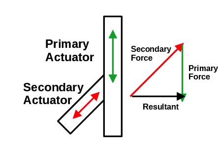
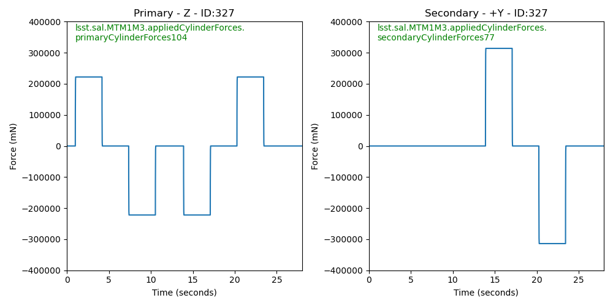

:tocdepth: 1

.. sectnum::

.. Metadata such as the title, authors, and description are set in metadata.yaml

.. TODO: Delete the note below before merging new content to the main branch.

Abstract
========

To test the functionality of the pneumatic actuators on the M1M3 mirror cell, small perturbations are applied to each of the actuators in turn.  This technote describes those tests and how to access the test results from the EFD.

Introduction
================
The M1M3 mirror cell supports the weight of the M1M3 primary mirror for the Simonyi telescope.  The 17 tons of mirror are supported by 156 pneumatic actuators where 44 are single-axis and provide support only in the axial direction (parallel to the telescope optical axis), 100 are dual-axis providing support in the axial and lateral direction, and 12 are dual-axis providing support in the axial and cross lateral directions.  Figures 1 and 2 show the locations of the actuators.  Figure 2 shows the actuator types.  Note that most of the dual-axis actuators apply force in the +Y direction.  This is because this is the force needed to support the weight of the mirror as the telescope tilts to lower elevations.

.. image:: ./_static/Actuators.png

Figure 1.  A screenshot of the MTM1M3 GUI, showing the actuator locations and IDs.

.. image:: ./_static/Actuator_Types.png

Figure 2. This figure shows the actuator types.

Positioning is provided by 6 hard points in a hexapod configuration which moves the mirror to a fixed operational position that shall be maintained during telescope operations. The remaining optical elements will be moved relative to this position in order to align the telescope optics. Support and optical figure correction is provided by the pneumatic actuators.
Each actuator consists of a piston and valves to apply compressed air on either side of the piston, so that each actuator has the capability to push and pull.

To test the functionality of the actuators, there is a test applied to each actuator which is referred to as a "bump test". This is usually performed with the mirror lowered (on static support), so the force actuators can be tested before the mirror is raised. The test is performed by applying an additional force of about 200 Newtons in both the positive and negative directions. For actuators that are dual-axis, the primary actuator (in the axial direction) is bumped first, followed by the secondary actuator. The bump test can be performed on either a single cylinder, or a single actuator, or it can be cycled through all of the actuators in succession.

Bump Test Overview
======================

During the bump test, perturbations of about 200 N are applied to the actuators for a few seconds.  Figure 3 shows the target forces to be applied, and Figure 4 shows the actual measured forces.

.. image:: ./_static/Bump_Test_Target.png

Figure 3.  This shows the target forces to be applied to the actuators during the bump test of a single actuator.

.. image:: ./_static/Bump_Test_Results.png

Figure 4. This shows the actual measured forces applied by the actuators during the bump test of a single actuator

Bump Test Indexing
==================================

The actuators are numbered sequentially from 0-155.  The secondary cylinders and the X, Y, and Z forces are also numbered sequentially.  Since there are different numbers of each of these, a set of look-up tables are provided to go from the actuator ID to the sequential numbers of the actuators of different types.  Table 1 shows how to move between the actuator IDs, the actuator index, and the indices for the various types of actuators. 

| from lsst.ts.criopy import M1M3FATable
|
| Actuator ID (as in Figure 1): 101
| M1M3FATable.actuator_id_to_index(101) : 0
| Actuator ID (as in Figure 1): 227
| M1M3FATable.actuator_id_to_index(227) : 61
| M1M3FATable.actuator_id_to_index(227, M1M3FATable.FAIndex.SECONDARY):46
| M1M3FATable.actuator_id_to_index(227, M1M3FATable.FAIndex.Y):42
| M1M3FATable.actuator_id_to_index(227, M1M3FATable.FAIndex.Z): 61
|
| Since all actuators provide force in the Z direction, the ZINDEX and the INDEX are equal.
|
| The following actuator is one of the 12 that provides force in the X direction.
|
| Actuator ID (as in Figure 1): 135
| M1M3FATable.actuator_id_to_index(135) : 34
| M1M3FATable.actuator_id_to_index(135, M1M3FATable.FAIndex.X): 2

Table1: Navigating between actuator IDs and sequential indices.

Bump Test States
==================================

As the bump test cycles through the testing, the EFD location:

| lsst.sal.MTM1M3.logevent_forceActuatorBumpTestStatus
|

returns where in the bump test cycle the test is.  Figure 5 shows the progression of these states.  At the conclusion of the test for each actuator, the state will either be 6 (PASSED) or 7 (FAILED).  the pass-fail criteria are described later in the "Bump Test Following Errors" section.

Figure 5. This shows the bump test states as logged in  lsst.sal.MTM1M3.logevent_forceActuatorBumpTestStatus.

XYZ forces vs Cylinder forces
==============================

The force data in the EFD includes both the forces applied to the primary and secondary cylinders, as well as the forces in the X, Y, and Z directions.  The X, Y, and Z directions are in the mirror coordinate system, as described in this link (https://confluence.lsstcorp.org/pages/viewpage.action?pageId=47220348). The cylinder forces and the X, Y, Z forces are not the same, as will be explained in this section.  Referring to Figure 6, we see that the primary cylinder applies force in the axial direction, which is along the optical axis of the telescope, and is referred to as the Z direction.  So the force applied by the primary cylinder is equal to the Z-force.  The secondary cylinder however, is at a 45 degree angle to the Z-axis.  So if we want to apply a force in the lateral direction (X or Y), we need to apply a force with the secondary cylinder, and then a negative force with the primary cylinder so that the resultant is in the lateral direction.
As the angle of the secondary cylinder is 45 degrees, transforming mirror coordinate systems forces into secondary cylinder is (mirror_force) / sqrt(2). Assume Z and Y Dual Axis Actuator (DAA) should produce Z force +10 N, and Y +25 N. Then the primary cylinder force would be 10 - (25 / sqrt(2)) N, and secondary cylinder force would be 25 / sqrt(2) N.

Figure 6. This schematic of the actuators shows the relation between the cylinder forces and the resulting axial and lateral forces.

The primary and secondary forces are what is actually measured, and the X, Y, and Z forces are calculated from these forces and the known geometry.  So Figures 3 and 4 show the Y and Z forces.  Figures 7 and 8 show the target and actual forces in the primary and secondary cylinders.  Note the negative primary force being applied during the secondary bump test.

Figure 7.  This shows the target forces to be applied to the primary and secondary actuators during the bump test of a single actuator.

Figure 8. This shows the actual measured forces applied by the primary and secondary actuators during the bump test of a single actuator

Bump Test Following Errors
==============================

We can also plot the bump test following errors, which are the difference between the target force and the actual measured force.  The actuator is not able to follow the step function in the applied force, so there is large spike in the following error after a change in the target force.  For this reason, the plot in Figure 9 uses the "symlog" scale, which is linear between -10 N and +10 N, and log above +/-10 N.  This allows one to see the errors in the relatively flat region of the test, which is most important.

Figure 9. Bump test following errors.

The levels and times for the absolute value of the following error are specified in M1M3 SS CSC configuration file (ts_config_mttcs/MTM1M3/v1/_init.yaml):

|
|  BumpTest:
|    TestedTolerances:
|      Warning: 2.5 (green lines in Figure 9)
|      Error: 5 (red lines in Figure 9)
|    NonTestedTolerances:
|      Warning: 20
|      Error: 100
|    SettleTime: 3.0
|    Measurements: 10
|

Where non-tested mean all other Force Actuators (FAs)s (the algorithm checks if all other except for tested cylinder doesn't show significant force), tested are error and warning levels for cylinder being tested. The algorithm waits up to SettleTime seconds to see "Measurements" number of measured absolute values dropping below errorr level for FA to pass the test. If measured values venture above "warning" level, but stay within "error" level, a warning is sent into the M1M3 log.

Summary
==============

This technote describes the M1M3 mirror cell bump tests and describes how they are done and shows some of the results.  All of the plots shown here can be reproduced with the following notebook:

| https://github.com/craiglagegit/Notebook_Keeper/blob/main/
| mtm1m3_notebooks/MTM1M3_Bump_Test_Technote_Plots_29Jun23.ipynb
|
